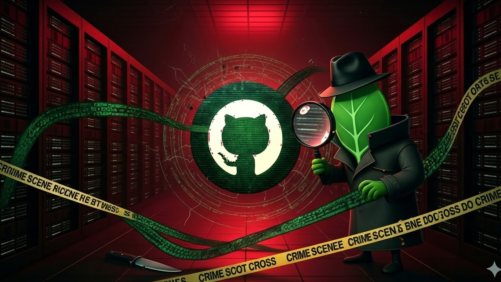
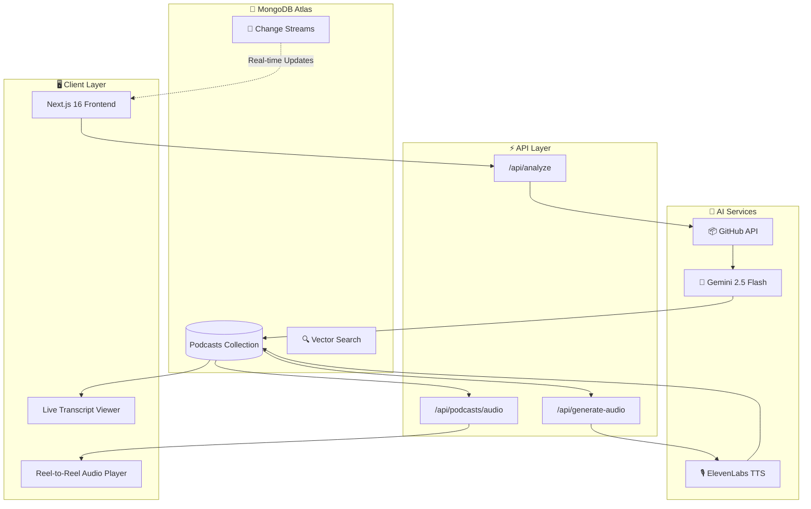
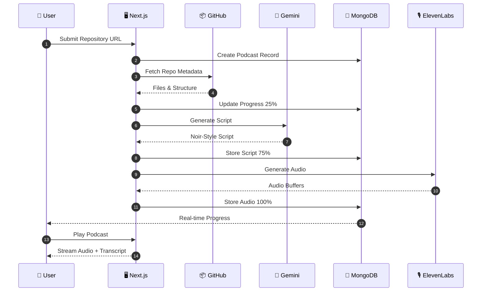
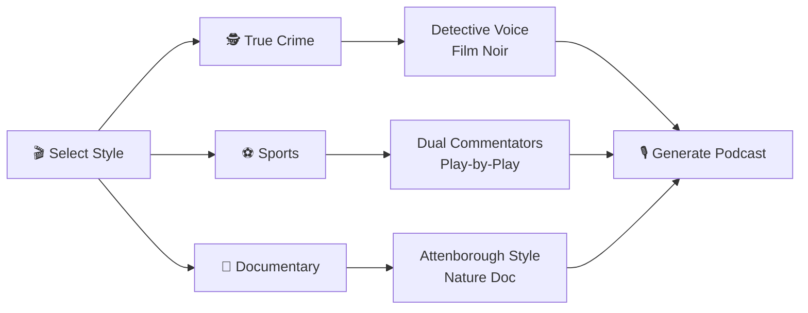

<p align="center">
  
</p>

<h1 align="center">🕵️ ATLAS FORENSIC VAULT</h1>

<h3 align="center"><i>"Every Repository Has a Story. We Make It Talk."</i></h3>

<p align="center">
  <a href="https://nextjs.org/"></a>
  <a href="https://www.mongodb.com/atlas"></a>
  <a href="https://elevenlabs.io/"></a>
  <a href="https://deepmind.google/technologies/gemini/"></a>
  <a href="https://vercel.com"></a>
</p>

<p align="center">
  <a href="https://mlh.isoumya.xyz">🌐 Live Demo</a> •
  <a href="#-demo-video">📺 Video Demo</a> •
  <a href="#-key-features">✨ Features</a>
</p>

---

# 🎯 The Problem

**Developers are drowning in code they didn't write.**

<div align="center">

| Challenge | Pain Point |
|:---------:|:----------:|
| 📚 Documentation | Reading docs is time-consuming |
| 🔍 New Codebases | Understanding takes hours/days |
| 🎧 Passive Learning | Can't learn while commuting |
| 📖 Code Reviews | Traditional reviews are dry & boring |

</div>

---

## 💡 Our Solution

**Atlas Forensic Vault** transforms any GitHub repository into an engaging **AI-generated podcast** narrated in a Film Noir detective style.

> *"In this city, every line of code tells a story. Most of them are tragedies. Some are comedies. But in my precinct? They're all mysteries until I say otherwise."*
> 
> — **Det. Mongo D. Bane**

### 🎬 How It Works

```
1️⃣ SUBMIT    →    2️⃣ INVESTIGATE    →    3️⃣ LISTEN    →    4️⃣ LEARN
   GitHub URL         AI Analysis           Podcast           Understand
```

---

# 🏗️ System Architecture

### High-Level Overview



### 🔄 Data Flow Sequence



### 🎭 Narrative Styles



---

# 🔧 Tech Stack

<div align="center">

| Category | Technologies |
|:--------:|:------------:|
| **Frontend** |     |
| **Animation** |   |
| **Database** |  |
| **AI Services** |   |
| **Deployment** |  |

</div>

### 📦 Detailed Stack

<div align="center">

| Layer | Technology | Purpose |
|:-----:|:----------:|:-------:|
| **Frontend** | Next.js 16, React 19, TypeScript | Server-side rendering, type safety |
| **Styling** | Tailwind CSS 4, Framer Motion | Responsive design, animations |
| **3D Graphics** | Three.js, React Three Fiber | Immersive UI elements |
| **Database** | MongoDB Atlas | Document storage, vector search |
| **AI - Script** | Google Gemini 2.5 Flash | Codebase analysis, script generation |
| **AI - Voice** | ElevenLabs Multilingual v2 | High-quality text-to-speech |
| **Hosting** | Vercel (Pro) | Serverless deployment, 300s timeout |
| **API** | GitHub REST API | Repository data fetching |

</div>

---

# ✨ Key Features

### 🎙️ 1. AI-Powered Code Narration
Transform any GitHub repository into an engaging podcast with multiple narrative styles:

<div align="center">

| Style | Voice | Description |
|:-----:|:-----:|:-----------:|
| 🕵️ **True Crime** | Detective | Film noir investigation of "code crimes" |
| ⚽ **Sports** | Dual Commentators | Exciting play-by-play of the codebase |
| 🦁 **Documentary** | Attenborough | Nature doc style exploration |

</div>

### 🎛️ 2. Retro Reel-to-Reel Player
- 🎞️ Spinning tape reel animations
- 🔘 Vintage brushed-metal aesthetic
- 📊 Progress tracking with visual feedback

### 📜 3. Live Transcript Synchronization
- ✨ Real-time highlighting as audio plays
- 📍 Auto-scroll follows the narration
- 👆 Click-to-seek on any text segment

### 🔍 4. MongoDB Atlas Integration
- **Vector Search** - Semantic search across transcripts
- **Change Streams** - Real-time progress updates
- **Flexible Schema** - Dynamic podcast structures

### 📄 5. Export Options
- **🟢 Redacted** - Shareable summary
- **🔴 Classified** - Full investigation report

---

# 📊 MongoDB Atlas Integration

### Why MongoDB Atlas?

We leverage **three key MongoDB Atlas features**:

<div align="center">

| Feature | Use Case | Benefit |
|:-------:|:--------:|:-------:|
| 📄 **Flexible Schema** | Store variable segment counts | No rigid table structures |
| 🔍 **Vector Search** | Semantic transcript search | Find similar codebases |
| 📡 **Change Streams** | Real-time progress updates | No polling required |

</div>

### 1. Flexible Schema
```javascript
// Each podcast has different segment counts and metadata
{
  id: "abc-123",
  script: {
    title: "CASE FILE #REACT-HOOKS",
    segments: [
      { speaker: "narrator", text: "...", emotion: "mysterious" },
      { speaker: "sound_effect", text: "thunder" },
      // Variable number of segments per podcast
    ]
  },
  analysis_summary: { /* Dynamic fields based on repo */ }
}
```

### 2. Vector Search
```javascript
// Find similar podcast transcripts
db.podcasts.aggregate([
  {
    $vectorSearch: {
      queryVector: embeddings,
      path: "script_embedding",
      numCandidates: 100,
      limit: 5
    }
  }
]);
```

### 3. Change Streams
```javascript
// Real-time progress updates to frontend
const changeStream = collection.watch([
  { $match: { "fullDocument.id": podcastId } }
]);

changeStream.on("change", (change) => {
  updateClientProgress(change.fullDocument.progress);
});
```

---

# 🚀 Getting Started

### Prerequisites

- Node.js 18+
- MongoDB Atlas account
- API keys for Gemini & ElevenLabs

### Installation

```bash
# Clone the repository
git clone https://github.com/SoumyaEXE/Atlas-Forensic-Vault.git
cd Atlas-Forensic-Vault

# Install dependencies
npm install

# Configure environment variables
cp .env.example .env.local
```

### Environment Variables

```env
# MongoDB Atlas
MONGODB_URI=mongodb+srv://...

# AI Services
GEMINI_API_KEY=your_gemini_api_key
ELEVENLABS_API_KEY=your_elevenlabs_api_key

# GitHub (optional, increases rate limit)
GITHUB_TOKEN=your_github_token
```

### Run Development Server

```bash
npm run dev
```

Visit **http://localhost:3000**

---

## 🏆 Hackathon Highlights

<div align="center">

| Criteria | Implementation |
|:--------:|:--------------:|
| ✅ **MongoDB Atlas** | Vector Search + Change Streams + Flexible Schema |
| ✅ **Innovation** | First-ever code-to-podcast with Film Noir theme |
| ✅ **AI Integration** | Gemini for analysis, ElevenLabs for voice |
| ✅ **Production Ready** | Deployed and functional on Vercel |
| ✅ **Real-World Utility** | Actually helps developers understand codebases |

</div>

---

## 👥 Team LowEndCorp.

<div align="center">

| 👨‍💻 Soumya | 👨‍💻 Subarna | 👨‍💻 Saikat | 👨‍💻 Sourish |
|:-------------:|:-------------:|:-------------:|:-------------:|
| **Full Stack Developer** | **Android Developer** | **DevOps Engineer** | **Competitive Programmer** |
| [](https://github.com/SoumyaEXE) | [](https://github.com/Dronzer2Code) | [](https://github.com/saviour2) | [](https://github.com/T-Rexbytes) |

</div>

---

## 📄 License

This project is licensed under the MIT License - see the [LICENSE](LICENSE) file for details.

---

<div align="center">

### 🕵️ *"Case Closed."*

**Built with ❤️ for MLH Hack For Hackers!**

[](https://www.mongodb.com/atlas)

</div>
