<

# 🕵️ ATLAS FORENSIC VAULT

### *"Every Repository Has a Story. We Make It Talk."*

[](https://nextjs.org/)
[](https://www.mongodb.com/atlas)
[](https://elevenlabs.io/)
[](https://deepmind.google/technologies/gemini/)
[](https://vercel.com)

[🌐 Live Demo](https://mlh.isoumya.xyz) • [📺 Video Demo](#demo) • [🎧 Sample Episode](#)

</div>

---

## 📋 Table of Contents

- [🎯 The Problem](#-the-problem)
- [💡 Our Solution](#-our-solution)
- [🏗️ System Architecture](#️-system-architecture)
- [🔧 Tech Stack](#-tech-stack)
- [✨ Key Features](#-key-features)
- [🚀 Getting Started](#-getting-started)
- [📊 MongoDB Atlas Integration](#-mongodb-atlas-integration)
- [🎨 Screenshots](#-screenshots)
- [👥 Team](#-team)
- [📄 License](#-license)

---

## 🎯 The Problem

**Developers are drowning in code they didn't write.**

- 📚 Reading documentation is time-consuming
- 🔍 Understanding new codebases takes hours/days
- 🎧 Learning while commuting or exercising is impossible
- 📖 Traditional code reviews are dry and boring

---

## 💡 Our Solution

**Atlas Forensic Vault** transforms any GitHub repository into an engaging **AI-generated podcast** narrated in a Film Noir detective style.

> *"In this city, every line of code tells a story. Most of them are tragedies. Some are comedies. But in my precinct? They're all mysteries until I say otherwise."*  
> — **Det. Mongo D. Bane**

### 🎬 How It Works

1. **Submit** a GitHub repository URL
2. **Watch** as our AI detective investigates the codebase
3. **Listen** to a dramatic narration of the code's "crime story"
4. **Learn** the architecture, patterns, and secrets within

---

## 🏗️ System Architecture

### 📊 High-Level Architecture

```mermaid
flowchart TB
    subgraph Client["🖥️ Client Layer"]
        UI[Next.js 16 Frontend]
        Player[Reel-to-Reel Audio Player]
        Transcript[Live Transcript Viewer]
    end

    subgraph API["⚡ API Layer"]
        Analyze["/api/analyze"]
        Generate["/api/podcasts/generate-audio"]
        Stream["/api/podcasts/audio"]
    end

    subgraph Services["🧠 AI Services"]
        GitHub[GitHub API]
        Gemini[Gemini 2.5 Flash]
        ElevenLabs[ElevenLabs TTS]
    end

    subgraph Database["🍃 MongoDB Atlas"]
        Podcasts[(Podcasts Collection)]
        VectorSearch[Vector Search Index]
        ChangeStreams[Change Streams]
    end

    UI --> Analyze
    Analyze --> GitHub
    GitHub --> Gemini
    Gemini --> Podcasts
    Podcasts --> Generate
    Generate --> ElevenLabs
    ElevenLabs --> Podcasts
    Podcasts --> Stream
    Stream --> Player
    Podcasts --> VectorSearch
    ChangeStreams --> UI
    Podcasts --> Transcript
```



### 🔄 Data Flow Sequence

```mermaid
sequenceDiagram
    autonumber
    participant User as 🕵️ User
    participant App as 🖥️ Next.js App
    participant GitHub as 📦 GitHub API
    participant Gemini as 🧠 Gemini AI
    participant MongoDB as 🍃 MongoDB Atlas
    participant ElevenLabs as 🎙️ ElevenLabs

    User->>App: Submit Repository URL
    App->>MongoDB: Create Podcast Record
    App->>GitHub: Fetch Repository Metadata
    GitHub-->>App: Files, Structure, README
    App->>MongoDB: Update Progress (25%)
    App->>Gemini: Generate Crime Investigation Script
    Gemini-->>App: Noir-Style Script with Segments
    App->>MongoDB: Store Script (75%)
    App->>ElevenLabs: Generate Audio for Each Segment
    ElevenLabs-->>App: Audio Buffers
    App->>MongoDB: Store Final Audio (100%)
    MongoDB-->>User: Real-time Progress via Change Streams
    User->>App: Play Podcast
    App->>MongoDB: Fetch Audio Data
    MongoDB-->>App: Audio + Transcript
    App-->>User: Stream Audio with Live Transcript
```



### 🎭 Narrative Styles State Machine


---

## 🔧 Tech Stack

<div align="center">


</div>

### 📦 Detailed Stack

| Layer | Technology | Purpose |
|-------|------------|---------|
| **Frontend** | Next.js 16, React 19, TypeScript | Server-side rendering, type safety |
| **Styling** | Tailwind CSS, Framer Motion | Responsive design, animations |
| **3D Graphics** | Three.js, React Three Fiber | Immersive UI elements |
| **Database** | MongoDB Atlas | Document storage, vector search |
| **AI - Script** | Google Gemini 2.5 Flash | Codebase analysis, script generation |
| **AI - Voice** | ElevenLabs Multilingual v2 | High-quality text-to-speech |
| **Hosting** | Vercel | Serverless deployment |
| **API** | GitHub REST API | Repository data fetching |

---

## ✨ Key Features

### 🎙️ 1. AI-Powered Code Narration
Transform any GitHub repository into an engaging podcast with multiple narrative styles:
- **🕵️ True Crime** - Film noir detective investigating "code crimes"
- **⚽ Sports Commentary** - Exciting play-by-play of the codebase
- **🦁 Documentary** - Nature documentary style exploration

### 🎛️ 2. Retro Reel-to-Reel Player
Custom-built audio player featuring:
- Spinning tape reel animations
- Vintage brushed-metal aesthetic
- Progress tracking with visual feedback

### 📜 3. Live Transcript Synchronization
- Real-time highlighting as audio plays
- Auto-scroll follows the narration
- Click-to-seek on any text segment

### 🔍 4. MongoDB Atlas Vector Search
- Semantic search across podcast transcripts
- Find similar codebases and patterns
- Intelligent content recommendations

### 📊 5. Real-Time Progress Updates
- MongoDB Change Streams for live status
- Visual progress bar with stage indicators
- No page refresh needed

### 📄 6. Export Options
- **Redacted** - Shareable summary
- **Classified** - Full investigation report with code references

---

## 🚀 Getting Started

### Prerequisites

- Node.js 18+
- MongoDB Atlas account
- API keys for Gemini & ElevenLabs

### Installation

```bash
# Clone the repository
git clone https://github.com/SoumyaEXE/Atlas-Forensic-Vault.git
cd Atlas-Forensic-Vault

# Install dependencies
npm install

# Configure environment variables
cp .env.example .env.local
```

### Environment Variables

```env
# MongoDB Atlas
MONGODB_URI=mongodb+srv://...

# AI Services
GEMINI_API_KEY=your_gemini_api_key
ELEVENLABS_API_KEY=your_elevenlabs_api_key

# GitHub (optional, increases rate limit)
GITHUB_TOKEN=your_github_token
```

### Run Development Server

```bash
npm run dev
```

Visit [http://localhost:3000](http://localhost:3000)

---

## 📊 MongoDB Atlas Integration

### Why MongoDB Atlas?

Atlas Forensic Vault leverages **three key MongoDB Atlas features**:

```mermaid
graph LR
    subgraph MongoDB Atlas
        A[📄 Flexible Schema] --> D[Store Complex Scripts]
        B[🔍 Vector Search] --> E[Semantic Transcript Search]
        C[📡 Change Streams] --> F[Real-Time Progress Updates]
    end

    D --> G[Variable Segment Counts]
    D --> H[Nested Metadata]
    E --> I[Find Similar Codebases]
    E --> J[Pattern Matching]
    F --> K[Live UI Updates]
    F --> L[No Polling Required]
```



### 1. Flexible Schema
```javascript
// Each podcast has different segment counts and metadata
{
  id: "abc-123",
  script: {
    title: "CASE FILE #REACT-HOOKS",
    segments: [
      { speaker: "narrator", text: "...", emotion: "mysterious" },
      { speaker: "sound_effect", text: "thunder" },
      // Variable number of segments
    ]
  },
  analysis_summary: {
    // Dynamic fields based on repo
  }
}
```

### 2. Vector Search
```javascript
// Find similar podcast transcripts
db.podcasts.aggregate([
  {
    $vectorSearch: {
      queryVector: embeddings,
      path: "script_embedding",
      numCandidates: 100,
      limit: 5
    }
  }
])
```

### 3. Change Streams
```javascript
// Real-time progress updates to frontend
const changeStream = collection.watch([
  { $match: { "fullDocument.id": podcastId } }
]);

changeStream.on("change", (change) => {
  // Push update to client via SSE/WebSocket
  updateClientProgress(change.fullDocument.progress);
});
```

---

## 🎨 Screenshots

<div align="center">

| Landing Page | Investigation in Progress |
|:---:|:---:|
|  | *Analysis UI* |

| Audio Player | Transcript View |
|:---:|:---:|
| *Reel-to-Reel Player* | *Live Sync Transcript* |

</div>

---

## 🏆 Hackathon Highlights

- ✅ **Innovative Use of MongoDB Atlas** - Vector Search + Change Streams + Flexible Schema
- ✅ **AI-First Architecture** - Gemini for analysis, ElevenLabs for voice
- ✅ **Production Ready** - Deployed and functional on Vercel
- ✅ **Unique UX** - Film noir theme with retro audio player
- ✅ **Real-World Utility** - Actually helps developers understand codebases

---

## 👥 Team

<div align="center">

| Developer |
|:---:|
| **Soumya** |
| Full Stack Developer |
| [GitHub](https://github.com/SoumyaEXE) |

</div>

---

## 📄 License

This project is licensed under the MIT License - see the [LICENSE](LICENSE) file for details.

---

<div align="center">

### 🕵️ *"Case Closed."*

**Built with ❤️ for MongoDB x DEV Hackathon**

[](https://www.mongodb.com/atlas)

</div>
]]>
