<p align="center">
  
</p>

<div align="center">
  
</div>


<h3 align="center"><i>"Every Repository Has a Story. We Make It Talk."</i></h3>

<p align="center">
  <a href="https://nextjs.org/"></a>
  <a href="https://www.mongodb.com/atlas"></a>
  <a href="https://elevenlabs.io/"></a><br/>
  <a href="https://deepmind.google/technologies/gemini/"></a>
  <a href="https://vercel.com"></a>
</p>

# 🎯 The Problem :

**Developers are drowning in code they didn't write.**

```mermaid
flowchart TB
    A[👨‍💻 Developer]
    B[📚 Documentation]
    C[🔍 New Codebases]
    D[🎧 Passive Learning]
    E[📖 Code Reviews]

    A --> B
    A --> C
    A --> D
    A --> E

    B --> B1[⏳ Reading is time-consuming]
    C --> C1[🕒 Understanding takes hours/days]
    D --> D1[🚫 Can't learn while commuting]
    E --> E1[😴 Reviews are dry & boring]

    B1 --> F[❌ Productivity Loss]
    C1 --> F
    D1 --> F
    E1 --> F
```

<div align="center">




</div>


## 💡 Our Solution :

**Atlas Forensic Vault** transforms any GitHub repository into an engaging **AI-generated podcast** narrated in a Film Noir detective style.

> *"In this city, every line of code tells a story. Most of them are tragedies. Some are comedies. But in my precinct? They're all mysteries until I say otherwise."*
> 
> — **Det. Mongo D. Bane**

### 🎬 How It Works

```mermaid
flowchart LR
    A[🧾 1. Submit<br/>GitHub Repository] --> B[🕵️ 2. Investigate<br/>AI Code Analysis]
    B --> C[🎙️ 3. Listen<br/>Generated Podcast]
    C --> D[🧠 4. Learn<br/>Deep Understanding]
```



# 🏗️ System Architecture :

### High-Level Overview

```mermaid
flowchart TB
    subgraph Client["🖥️ Client Layer"]
        UI["Next.js 16 Frontend"]
        Player["Reel-to-Reel Audio Player"]
        Transcript["Live Transcript Viewer"]
    end

    subgraph API["⚡ API Layer"]
        Analyze["/api/analyze"]
        Generate["/api/generate-audio"]
        Stream["/api/podcasts/audio"]
    end

    subgraph Services["🧠 AI Services"]
        GitHub["📦 GitHub API"]
        Gemini["🧠 Gemini 2.5 Flash"]
        Eleven["🎙️ ElevenLabs TTS"]
    end

    subgraph Database["🍃 MongoDB Atlas"]
        Podcasts[("Podcasts Collection")]
        Vector["🔍 Vector Search"]
        Changes["📡 Change Streams"]
    end

    UI --> Analyze
    Analyze --> GitHub
    GitHub --> Gemini
    Gemini --> Podcasts
    Podcasts --> Generate
    Generate --> Eleven
    Eleven --> Podcasts
    Podcasts --> Stream
    Stream --> Player
    Changes -.->|Real-time Updates| UI
    Podcasts --> Transcript
```



### 🔄 Data Flow Sequence

```mermaid
sequenceDiagram
    autonumber
    participant User as 👤 User
    participant App as 🖥️ Next.js
    participant GitHub as 📦 GitHub
    participant Gemini as 🧠 Gemini
    participant DB as 🍃 MongoDB
    participant Voice as 🎙️ ElevenLabs

    User->>App: Submit Repository URL
    App->>DB: Create Podcast Record
    App->>GitHub: Fetch Repo Metadata
    GitHub-->>App: Files & Structure
    App->>DB: Update Progress 25%
    App->>Gemini: Generate Script
    Gemini-->>App: Noir-Style Script
    App->>DB: Store Script 75%
    App->>Voice: Generate Audio
    Voice-->>App: Audio Buffers
    App->>DB: Store Audio 100%
    DB-->>User: Real-time Progress
    User->>App: Play Podcast
    App-->>User: Stream Audio + Transcript
```



### 🎭 Narrative Styles

```mermaid
graph LR
    A[🎬 Select Style] --> B[🕵️ True Crime]
    A --> C[⚽ Sports]
    A --> D[🦁 Documentary]
    
    B --> E["Detective Voice<br/>Film Noir"]
    C --> F["Dual Commentators<br/>Play-by-Play"]
    D --> G["Attenborough Style<br/>Nature Doc"]
    
    E --> H[🎙️ Generate Podcast]
    F --> H
    G --> H
```



# 🔧 Tech Stack :

<div align="center">

| Category | Technologies |
|:--------:|:------------:|
| **Frontend** |     |
| **Animation / UI** |   |
| **Database** |  |
| **AI Services** |   |
| **Deployment** |  |

</div>

### 📦 Detailed Stack :

<div align="center">

| Layer | Technology | Purpose |
|:-----:|:----------:|:-------:|
| **Frontend** | Next.js 16, React 19, TypeScript | Server-side rendering, type safety |
| **Styling** | Tailwind CSS 4, Framer Motion | Responsive design, animations |
| **3D Graphics** | Three.js, React Three Fiber | Immersive UI elements |
| **Database** | MongoDB Atlas | Document storage, vector search |
| **AI - Script** | Google Gemini 2.5 Flash | Codebase analysis, script generation |
| **AI - Voice** | ElevenLabs Multilingual v2 | High-quality text-to-speech |
| **Hosting** | Vercel (Pro) | Serverless deployment, 300s timeout |
| **API** | GitHub REST API | Repository data fetching |

</div>

# ✨ Key Features :

<div align="center">

| Feature | Description |
|:------:|:-----------:|
| 🎙️ **AI Code Narration** | GitHub repo → AI podcast |
| 🎛️ **Retro Audio Player** | Reel animations · Vintage UI |
| 📜 **Live Transcript** | Real-time sync · Click-to-seek |
| 🔍 **MongoDB Atlas** | Vector Search · Change Streams |
| 📄 **Export Reports** | Redacted · Classified |

</div>

# 🚀 Getting Started :

> Spin up **Atlas Forensic Vault** locally in minutes.

## 🧰 Requirements :

_Ensure the following are installed and ready_

- **Node.js** ≥ 18 (LTS recommended)
- **MongoDB Atlas** cluster (free tier works)
- **API Keys**
  - Google **Gemini**
  - **ElevenLabs** (Text-to-Speech)
- *(Optional)* GitHub token for higher API rate limits


## 📦 Project Setup :

_Clone the repository and install dependencies_

```bash
git clone https://github.com/SoumyaEXE/Atlas-Forensic-Vault.git
cd Atlas-Forensic-Vault
npm install
```
## 🔐 Environment Configuration :
_Create a local environment file_

```bash
cp .env.example .env.local
```
> Add the required keys:
```bash
env
```

## 🥬 MongoDB Atlas :
```bash
MONGODB_URI=mongodb+srv://<username>:<password>@cluster.mongodb.net/atlas_forensic_vault
```

## 🤖 AI Services :
```bash
GEMINI_API_KEY=your_gemini_api_key
ELEVENLABS_API_KEY=your_elevenlabs_api_key
```

## ✒️ GitHub (optional – improves rate limits)
```bash
GITHUB_TOKEN=your_github_token
```
▶️ Run the App
Start the development server:

```bash
npm run dev
```
> The app will boot with hot reload enabled.

🌐 Access the Application
Open in your browser:

```bash
http://localhost:3000
```
> You’re ready to investigate repositories. 🕵️

## 🏆 Hackathon Highlights :

<div align="center">

| Focus Area | What We Delivered |
|:----------:|:-----------------:|
| 🍃 **MongoDB Atlas Excellence** | Vector Search · Change Streams · Flexible Schema |
| 💡 **Product Innovation** | Code-to-podcast experience with Film Noir narrative |
| 🧠 **AI-First Architecture** | Gemini for deep analysis · ElevenLabs for narration |
| 🚀 **Production Readiness** | Fully deployed, live, and scalable on Vercel |
| 🛠️ **Developer Impact** | Faster onboarding and deeper code understanding |

</div>

## 👥 Team LowEndCorp. Members :

<div align="center">

| 👨‍💻 Soumya | 👨‍💻 Subarna | 👨‍💻 Saikat | 👨‍💻 Sourish |
|:-------------:|:-------------:|:-------------:|:-------------:|
| **Full Stack Developer** | **Android Developer** | **DevOps Engineer** | **Competitive Programmer** |
| [](https://github.com/SoumyaEXE) | [](https://github.com/Dronzer2Code) | [](https://github.com/saviour2) | [](https://github.com/T-Rexbytes) |

</div>

<!--
## 📄 License

This project is licensed under the MIT License - see the [LICENSE](LICENSE) file for details.

---

<div align="center"> --->

<div align="center">
  
_**"🕵️ Case Closed."**_ <br/>
**Built with ❤️ for MLH Hack For Hackers!**

[](https://www.mongodb.com/atlas)
[](https://www.cloudflare.com/)
[](https://elevenlabs.io/)

</div>
