# 📁 CASE FILE: ATLAS FORENSIC VAULT
### CASE ID: #D71DE589
### STATUS: **ACTIVE INVESTIGATION**
### LEAD DETECTIVE: **MONGO D. BANE**

---

## 🕵️‍♂️ THE MISSION

It’s a cold world out there. Code gets written, pushed, and forgotten—buried in the commit history like a body in the foundation of a new skyscraper. That’s where we come in.

**The Atlas Forensic Vault.**

We don't just read code; we interrogate it. We turn those silent repositories into singing canaries. Our operation is simple but brutal: we take a suspicious GitHub repository, run it through the wringer, and spit out a **Forensic Audio Case File**.

To the layman, it looks like a podcast. To us? It’s the truth, served cold. We use advanced **Vector Search** to find the motive, **Change Streams** to catch them in the act, and generative AI to narrate the confession.

---

## 🏗️ SURVEILLANCE ARCHITECTURE

We've built a system that sees everything. Nothing leaves the precinct without being logged, analyzed, and filed.

### 🎞️ The Chain of Custody (Sequence of Events)

```mermaid
sequenceDiagram
    participant Suspect as 🕵️ User (Informant)
    participant System as 🖥️ Next.js Terminal
    participant Brain as 🧠 Gemini 3.0 Flash
    participant Vault as 🍃 MongoDB Atlas
    participant Voice as 🎙️ ElevenLabs v2
    participant Storage as ☁️ Cloudflare R2

    Suspect->>System: Submits Repo URL (The Tip)
    System->>Brain: Deep-Code Analysis Request
    Brain->>Brain: Profiling Codebase & Commits
    Brain-->>System: Generated Script & Motive
    System->>Vault: Store Vector Embeddings (The Evidence)
    System->>Voice: Request Narration (The Confession)
    Voice-->>Storage: Upload Audio File
    Storage-->>Suspect: Stream Forensic Case File
```



### 🚦 Clearance Protocols

Not every rookie gets to see the full picture. We have protocols.


---

## 🔫 HARDWARE SPECS

We don't run this operation on typewriters. We use heavy machinery.

### 🛠️ Tech Stack

| Category | Technologies |
|----------|-------------|
| **Frontend** | <a href="https://nextjs.org/"></a> |
| **Backend** | <a href="https://nodejs.org/"></a> |
| **Database** | <a href="https://www.mongodb.com/"></a> |
| **Tools** | <a href="https://git-scm.com/"></a> |

* **MongoDB Atlas**: The Vault. Using **Vector Search** to connect the dots between disparate commits, **Change Streams** to monitor the wire in real-time, and **Flexible Schema** to handle the messy data of the digital back alleys.
* **Cloudflare**: The Perimeter. **Workers AI** for edge profiling, **R2** for stashing the tapes (egress-free), and **Durable Objects** to keep our terminals synced across the city.
* **Gemini 3.0 Flash**: The Brains. Digs deep into the syntax to find the hidden intent and writes the script.
* **ElevenLabs Multilingual v2**: The Voice. Gravelly, tired, and honest.

---

## 📂 FORENSIC EVIDENCE (KEY FEATURES)

### 1. The Wiretap Interface v.0.9

A custom-built audio player with brushed-metal chassis and hex-bolts. Featuring **spinning reel-to-reel animations** that activate as the signal is decrypted.

### 2. Transcript Log

We don't trust memory. Real-time highlighting and auto-scrolling synced to the audio. As Det. Bane narrates, the text illuminates sentence-by-sentence.

### 3. Clearance Level Exports

Need to take the case to the DA? Export findings as **Redacted** (blacked-out sensitive logic) or **Classified** (full unredacted dossier) forensic PDFs.

---

## 🕵️‍♀️ INSTALLATION FOR AGENTS

1. **Clone the Repository** (Keep it quiet):
```bash
git clone https://github.com/SoumyaEXE/atlas-forensic-vault.git
cd atlas-forensic-vault
```

2. **Install Dependencies** (Load your weapon):
```bash
npm install
```

3. **Configure Environment** (Set your wiretap):
Create a `.env.local` file with your clearance keys:
```env
MONGODB_URI=... # Atlas Connection String
GEMINI_API_KEY=... # The Brains
ELEVENLABS_API_KEY=... # The Voice
CLOUDFLARE_R2_BUCKET=... # The Evidence Locker
```

4. **Start Surveillance**:
```bash
npm run dev
```

---

## ⚖️ THE VERDICT

> "In this city, every line of code tells a story. Most of them are tragedies. Some are comedies. But in my precinct? They're all mysteries until I say otherwise. Case closed."
> — **Det. Mongo D. Bane**
